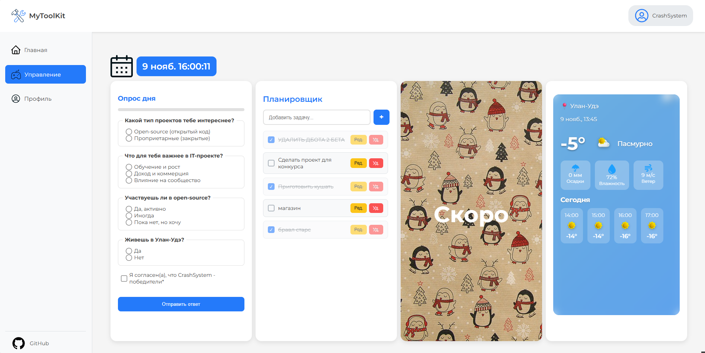

# MyToolKit — твоя персональная панель продуктивности



**MyToolKit** — это SPA-приложение, созданное с нуля как единое пространство для управления задачами, погодой, опросами и другими полезными модулями.  
Разработано в рамках конкурса «Открытые АЙТИ проекты» от СибГУТИ.

> 🔧 Чистый JavaScript | 🎨 Figma + CSS | ⚙️ Модульная архитектура

---

## 💡 О проекте

MyToolKit — не просто сборка из туториалов. Это **продукт, спроектированный, свёрстанный и закоденный одним разработчиком** (мной).  
Цель — создать **персональную панель**, где всё под рукой: от приветствия утром до планирования дня.

Проект использует:
- **SPA (Single Page Application)** — навигация без перезагрузки страницы.
- **Модульную систему** — каждый блок (погода, опрос, планировщик) — независимый компонент.
- **Чистый JavaScript** — без React, Vue или других фреймворков.
- **Адаптивный UI/UX** — продуманный дизайн в Figma, реализованный в коде.

---

🌐 Технологии
- HTML5
- CSS3
- JavaScript (ES6+, чистый JS)
- API: Open-Meteo, Nominatim (OpenStreetMap), Geolocation
- Хранение: localStorage

---

## 🚀 Функции

| Модуль | Описание |
|-------|--------|
| **Главная** | Приветствие по времени суток, анимированная цитата |
| **Управление** | Коллекция модулей: погода, опрос, планировщик |
| **Профиль** | Личная информация пользователя |
| **Погода** | Автоматическое определение местоположения, прогноз на 4 часа |
| **Опрос дня** | Интерактивный опрос |
| **Планировщик** | To-do list с сохранением в `localStorage` |

---

## 🧩 Архитектура: система модулей

Каждый модуль — это **независимый JS-файл**, который:
- Подключается через `<script src="./modules/...">`
- Регистрируется как глобальный объект: `window.Weather = { mount(containerId) }`
- Внедряет свои HTML, стили и логику в указанный контейнер
- Не влияет на другие модули

### ✅ Преимущества:
- Лёгкое расширение: любой может добавить свой модуль
- Изоляция стилей и логики
- Нет зависимости от сборщиков и фреймворков

---

## 🛠 Как добавить новый модуль?

1. Создай папку: `/modules/my-module/`
2. Добавь файл: `my-module.js`
3. Реализуй объект:
   ```js
   window.MyModule = {
       mount(containerId) {
           const container = document.getElementById(containerId);
           // Вставь HTML, стили, логику
       }
   };
4. Подключи в index.html:
   ```js
   <script src="./modules/my-module/my-module.js"></script>
5. Зарегистрируй в loadManagementModules():
   ```js
   MyModule.mount('module-my-module');
🎨 Дизайн-система
- Основной цвет: #247afa (синий)
- Шрифт: "Montserrat", sans-serif
- Размер модуля: 380px × 700px
- Радиус углов: 16px
- Тень: box-shadow: 0 4px 12px rgba(0,0,0,0.1)
- Фон модулей: белый (#fff) или с блюром (backdrop-filter)
- Анимации: плавные переходы между страницами

🤝 Автор
CrashSystem
Участник конкурса «Открытые IT проекты», СибГУТИ
   
